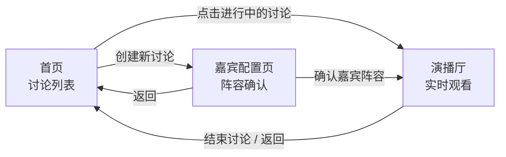
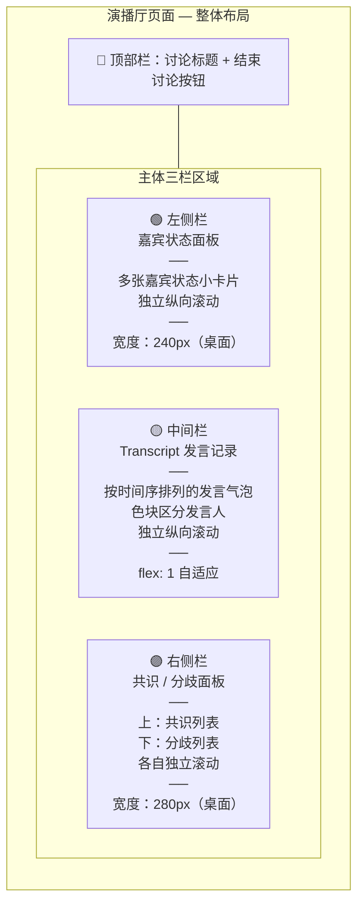
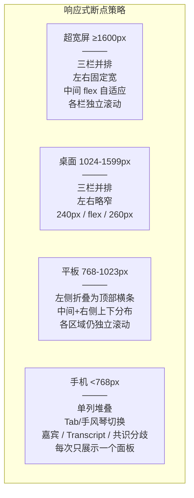

# AI Panel Studio — 前端页面与组件拆分设计

> **阶段**：DDD（Design-Driven Development，设计驱动开发）  
> **页面**：首页讨论列表、嘉宾配置页、演播厅主页面  
> **适配**：超宽屏 / 桌面 / 平板 / 手机响应式，全页面分区域独立滚动

---

## 1. 页面流转关系



### 路由表

| 路径 | 页面 | 说明 |
|:--|:--|:--|
| `/` | HomePage | 首页讨论列表 |
| `/setup/:discussionId` | GuestSetupPage | 嘉宾配置页，仅 SETUP 状态可进入 |
| `/studio/:discussionId` | StudioPage | 演播厅，IN_PROGRESS / COMPLETED 均可进入 |

---

## 2. 演播厅页面布局

### 2.1 整体布局（Mermaid 示意图）



### 2.2 响应式断点策略



---

## 3. 组件树总览

```
App
├── HomePage                  ← 首页：讨论列表
│   ├── PageHeader            ← 页面标题 "AI Panel Studio"
│   ├── DiscussionFilter      ← 状态筛选条
│   ├── DiscussionList        ← 讨论卡片列表（独立滚动）
│   │   └── DiscussionCard[]  ← 单张讨论卡片
│   └── CreateDiscussionModal ← 创建讨论弹窗
│
├── GuestSetupPage            ← 嘉宾配置页
│   ├── PageHeader            ← 页面标题 + 返回按钮
│   ├── TopicCard             ← 话题摘要卡片
│   ├── GuestGrid             ← 嘉宾阵容网格（响应式列数）
│   │   └── GuestProfileCard[]← 单张嘉宾信息卡
│   ├── RegenerateButton      ← 重新生成按钮
│   └── ConfirmButton         ← 确认并进入演播厅按钮
│
└── StudioPage                ← 演播厅主页面
    ├── StudioHeader          ← 顶部：标题 + 结束按钮 + 状态指示灯
    ├── GuestPanel            ← 左侧：嘉宾状态面板（独立滚动）
    │   └── GuestStatusCard[] ← 单张嘉宾实时状态小卡
    ├── TranscriptPanel       ← 中间：发言记录（独立滚动）
    │   └── SpeechBubble[]    ← 单条发言气泡
    └── ConsensusPanel        ← 右侧：共识/分歧面板（独立滚动）
        ├── ConsensusSection  ← 共识区块
        │   └── InsightCard[] ← 单条共识/分歧卡片
        └── DivergenceSection ← 分歧区块
            └── InsightCard[] ← 同上组件复用
```

---

## 4. 组件详细规格

### 4.1 全局/复用组件

#### `PageHeader`

| 项目 | 规格 |
|:--|:--|
| **用途** | 页面顶部统一标题栏 |
| **复用** | 首页、嘉宾配置页 |
| **Props** | `title: string` — 页面标题；`subtitle?: string` — 副标题；`onBack?: () => void` — 返回按钮回调（不传则不显示） |
| **交互** | 点击返回按钮调用 `onBack`，无其他交互 |

#### `CreateDiscussionModal`

| 项目 | 规格 |
|:--|:--|
| **用途** | 创建新讨论的弹窗表单 |
| **Props** | `isOpen: boolean` — 是否显示；`onClose: () => void` — 关闭回调；`onCreate: (topic: string, expertCount: number) => void` — 确认创建回调 |
| **内部状态** | `topic: string`，`expertCount: number`（默认 4，范围 2-8），`isSubmitting: boolean` |
| **交互** | 填写话题 → 调整人数滑块 → 点击「创建」调用 `onCreate` → 成功后路由跳转至嘉宾配置页；校验：topic 非空 1-200 字符；点击遮罩或取消按钮触发 `onClose` |

#### `InsightCard`

| 项目 | 规格 |
|:--|:--|
| **用途** | 单条共识或分歧内容卡（在 ConsensusPanel 中复用） |
| **Props** | `type: 'consensus' \| 'divergence'` — 类型；`content: string` — 内容文本；`relatedSpeechIds: string[]` — 关联发言 ID；`createdAt: string` — 创建时间 ISO；`onSpeechClick?: (speechId: string) => void` — 点击关联发言时跳转 Transcript 定位 |
| **视觉** | 共识卡片左侧绿色竖线；分歧卡片左侧橙色竖线；点击关联发言 ID 标签 → Transcript 对应气泡高亮闪烁 |
| **交互** | 点击关联发言标签触发 `onSpeechClick`，前端滚动 Transcript 到对应位置 |

---

### 4.2 首页 — HomePage

#### `DiscussionFilter`

| 项目 | 规格 |
|:--|:--|
| **用途** | 按讨论状态筛选的标签条 |
| **Props** | `activeStatus: string \| null` — 当前筛选值；`onFilter: (status: string \| null) => void` — 筛选变更回调 |
| **交互** | 标签：全部 / 待确认 / 进行中 / 已结束；点击标签 → `onFilter(status)`；选中标签高亮色 |

#### `DiscussionList`

| 项目 | 规格 |
|:--|:--|
| **用途** | 讨论卡片列表容器（独立纵向滚动） |
| **Props** | `discussions: DiscussionSummary[]` — 列表数据；`onJoin: (id: string) => void` — 进入讨论回调；`isLoading: boolean` |
| **交互** | 空列表展示引导文案 "暂无讨论，点击上方按钮发起第一场圆桌"；加载中展示骨架屏（3 行占位卡片）；滚动到底可加载更多（分页，通过回调通知父组件） |
| **数据来源** | `GET /api/discussions` |

#### `DiscussionCard`

| 项目 | 规格 |
|:--|:--|
| **用途** | 单场讨论摘要卡片 |
| **Props** | `discussion: DiscussionSummary`（id, topic, status, expertCount, guestCount, createdAt, updatedAt）；`onClick: (id: string) => void` |
| **交互** | 点击卡片 → `onClick(id)`，父组件根据 status 决定跳转：`SETUP` → 嘉宾配置页；`IN_PROGRESS` → 演播厅；`COMPLETED` → 演播厅（仅回放） |
| **视觉** | 状态标签颜色：SETUP=灰色, IN_PROGRESS=绿色呼吸灯, COMPLETED=蓝色；显示话题（截断 2 行）、嘉宾数、创建时间 |

---

### 4.3 嘉宾配置页 — GuestSetupPage

#### `TopicCard`

| 项目 | 规格 |
|:--|:--|
| **用途** | 展示当前讨论话题摘要 |
| **Props** | `topic: string`，`expertCount: number` |
| **交互** | 纯展示，无交互 |

#### `GuestGrid`

| 项目 | 规格 |
|:--|:--|
| **用途** | 响应式嘉宾卡片网格容器 |
| **Props** | `guests: Guest[]`（含主持人与专家） |
| **交互** | 纯布局容器，根据屏幕宽度调整列数（≥1024: 3列; 768-1023: 2列; <768: 1列） |

#### `GuestProfileCard`

| 项目 | 规格 |
|:--|:--|
| **用途** | 单张嘉宾信息展示卡 |
| **Props** | `guest: { id, name, role, occupation, title, stance, color, sortOrder }` |
| **视觉** | 左上角彩色色条（`guest.color`）；角色标签：主持人=金色徽章，专家=无；显示姓名(大)、Title(中)、职业(小)、立场(小，斜体)；主持人卡片在网格中置顶 |
| **交互** | 纯展示，hover 时轻微上浮阴影 |

#### `RegenerateButton`

| 项目 | 规格 |
|:--|:--|
| **用途** | 用户对阵容不满意时重新 AI 生成 |
| **Props** | `discussionId: string`；`onSuccess: (guests: Guest[]) => void` |
| **交互** | 点击 → 确认弹窗 "将丢弃当前阵容并重新生成" → 确定 → 调用 `POST /api/discussions/{id}/generate-guests` → loading 态 → 成功后 `onSuccess` 更新父组件；失败 toast 提示 |

#### `ConfirmButton`

| 项目 | 规格 |
|:--|:--|
| **用途** | 确认阵容并进入演播厅 |
| **Props** | `discussionId: string`；`disabled: boolean`（guests 为空时禁用） |
| **交互** | 点击 → 调用 `POST /api/discussions/{id}/confirm-guests` → loading → 成功后路由跳转 `/studio/{discussionId}`；失败 toast 提示 |

---

### 4.4 演播厅 — StudioPage

#### `StudioHeader`

| 项目 | 规格 |
|:--|:--|
| **用途** | 演播厅顶部栏：展示讨论标题 + 状态 + 结束按钮 |
| **Props** | `topic: string`；`status: DiscussionStatus`；`onEnd: () => void` |
| **视觉** | 背景深色（演播厅风格）；IN_PROGRESS 状态时显示红色呼吸圆点 + "直播中"；左侧话题标题；右侧结束按钮（红色描边） |
| **交互** | 结束按钮 → 二次确认 "确定结束当前讨论？" → `onEnd()` → 调用 `POST /api/discussions/{id}/end`；结束后按钮消失，显示"讨论已结束" |

#### `GuestPanel`

| 项目 | 规格 |
|:--|:--|
| **用途** | 左侧嘉宾实时状态面板（独立纵向滚动容器） |
| **Props** | `guests: GuestStatus[]`（id, name, role, color, runStatus, publicThought） |
| **视觉** | 面板标题 "嘉宾"；主持人在列表顶部（分隔线隔开）；专家按 sortOrder 排列；所有状态卡片排列 |
| **交互** | 面板自身 `overflow-y: auto`，独立滚动；如无内容显示 "等待嘉宾入场" |
| **数据来源** | 初始：`GET /api/discussions/{id}` 中 guests 字段；实时更新：WebSocket `guest_status_change` 事件 |

#### `GuestStatusCard`

| 项目 | 规格 |
|:--|:--|
| **用途** | 单张嘉宾实时状态小卡片 |
| **Props** | `guest: { id, name, role, color, runStatus, publicThought }` |
| **内部状态** | `prevRunStatus` — 用于触发状态切换动画 |
| **视觉** | 左侧色条（`color`）；顶部行：姓名 + 角色标签；状态指示灯：`IDLE`=灰色圆点，`PREPARING`=黄色脉冲圆点，`SPEAKING`=绿色跳动圆点 + 卡片边框辉光；`publicThought` 区域：PREPARING/SPEAKING 时显示打字机动画文本，IDLE 时灰色占位文字 "待机中..." |
| **交互** | 纯展示；状态切换时播放过渡动画（从 PREPARING→SPEAKING 卡片放大 5px + 阴影扩散；SPEAKING→IDLE 恢复） |
| **动画** | CSS transition 300ms ease；SPEAKING 状态：`box-shadow` 使用 `color` 色值的辉光效果 |

#### `TranscriptPanel`

| 项目 | 规格 |
|:--|:--|
| **用途** | 中间发言记录面板（独立纵向滚动容器） |
| **Props** | `speeches: Speech[]`（id, guestName, guestTitle, guestColor, content, speechType, sequence, createdAt）；`highlightedSpeechId?: string` — 从共识面板跳转时高亮的发言 ID |
| **内部状态** | `autoScroll: boolean` — 新发言是否自动滚底（用户手动上滚后暂停自动滚底） |
| **交互** | 面板自身 `overflow-y: auto`；新发言推送时，若 `autoScroll=true` 自动滚到底部；用户手动上滚 > 50px 关闭自动滚底，显示浮动 "回到底部 ↓" 按钮；收到 `new_speech` 事件追加新条；讨论结束时显示分隔线 "── 讨论结束 ──" |
| **数据来源** | 初始：`GET /api/discussions/{id}` + 单独获取历史 speeches；实时：WebSocket `new_speech` 事件 |

#### `SpeechBubble`

| 项目 | 规格 |
|:--|:--|
| **用途** | 单条发言气泡 |
| **Props** | `speech: { id, guestName, guestTitle, guestColor, content, speechType, sequence }`；`isHighlighted?: boolean` — 是否高亮（从共识面板跳转过来时） |
| **视觉** | 左侧色条（`guestColor`）；第一行：嘉宾名 + Title（小字灰色） + 色块小圆点；第二行起：发言正文；发言类型标签：COUNTER=红色小标签, ANSWER=蓝色, SUPPLEMENT=绿色, OPENING=金色, SUMMARY=紫色, 其余无标签；`isHighlighted=true` 时背景色闪烁一次（淡黄渐入渐出 1.5s） |
| **交互** | 纯展示，无交互 |

---

### 4.5 共识/分歧面板 — ConsensusPanel

#### `ConsensusPanel`

| 项目 | 规格 |
|:--|:--|
| **用途** | 右侧共识/分歧面板（作为整体容器，内部分上下两个独立滚动区域） |
| **Props** | `consensus: InsightRecord[]`；`divergence: InsightRecord[]`；`onSpeechClick: (speechId: string) => void` — 点击关联发言时传递给父组件以定位 Transcript |
| **视觉** | 面板标题 "共识与分歧"；上区 "✅ 共识 (N)"，绿色调背景；下区 "⚡ 分歧 (N)"，橙色调背景；两区各自 `overflow-y: auto`，内部独立滚动 |
| **交互** | 接收 WebSocket `consensus_update` 事件全量替换数据；新记录短暂渐入动画；列表为空时显示 "讨论刚开始，尚无共识/分歧" |
| **数据来源** | WebSocket `consensus_update` 事件 |

#### `ConsensusSection` / `DivergenceSection`

| 项目 | 规格 |
|:--|:--|
| **用途** | 独立的共识或分歧区块容器（带标题计数和独立滚动） |
| **Props** | `title: string`；`items: InsightRecord[]`；`type: 'consensus' \| 'divergence'`；`onSpeechClick: (speechId: string) => void` |
| **交互** | 内部渲染 `InsightCard[]`；空列表显示对应占位文字；独立滚动 |

---

## 5. 组件接口汇总表

| 组件 | 所属页面 | 是否复用 | 关键 Props |
|:--|:--|:--|:--|
| `PageHeader` | Home, GuestSetup | ✅ | `title`, `onBack?` |
| `CreateDiscussionModal` | Home | ❌ | `isOpen`, `onClose`, `onCreate` |
| `DiscussionFilter` | Home | ❌ | `activeStatus`, `onFilter` |
| `DiscussionList` | Home | ❌ | `discussions[]`, `onJoin`, `isLoading` |
| `DiscussionCard` | Home | ❌ | `discussion`, `onClick` |
| `TopicCard` | GuestSetup | ❌ | `topic`, `expertCount` |
| `GuestGrid` | GuestSetup | ❌ | `guests[]` |
| `GuestProfileCard` | GuestSetup | ❌ | `guest` |
| `RegenerateButton` | GuestSetup | ❌ | `discussionId`, `onSuccess` |
| `ConfirmButton` | GuestSetup | ❌ | `discussionId`, `disabled` |
| `StudioHeader` | Studio | ❌ | `topic`, `status`, `onEnd` |
| `GuestPanel` | Studio | ❌ | `guests[]` |
| `GuestStatusCard` | Studio | ❌ | `guest` (含 runStatus, publicThought) |
| `TranscriptPanel` | Studio | ❌ | `speeches[]`, `highlightedSpeechId?` |
| `SpeechBubble` | Studio | ❌ | `speech`, `isHighlighted?` |
| `ConsensusPanel` | Studio | ❌ | `consensus[]`, `divergence[]`, `onSpeechClick` |
| `ConsensusSection` / `DivergenceSection` | Studio | ❌ | `title`, `items[]`, `type`, `onSpeechClick` |
| `InsightCard` | Studio | ✅ | `type`, `content`, `relatedSpeechIds[]`, `onSpeechClick` |

---

## 6. 状态管理设计（Store 结构）

> 所有 Store 均为页面级，不可跨讨论共享。

### 6.1 首页 Store

```typescript
type HomeStore = {
  discussions: DiscussionSummary[]
  filter: DiscussionStatus | null
  isLoading: boolean
  isCreateModalOpen: boolean
}
```

### 6.2 嘉宾配置页 Store

```typescript
type GuestSetupStore = {
  discussion: DiscussionDetail | null
  guests: Guest[]
  isGenerating: boolean   // 正在调用 AI 生成
  isConfirming: boolean   // 正在调用确认接口
}
```

### 6.3 演播厅 Store（核心，同时监听 WebSocket）

```typescript
type StudioStore = {
  discussionId: string
  topic: string
  status: DiscussionStatus
  guests: Map<string, GuestRuntime>   // guestId → 实时状态，含 runStatus/publicThought
  speeches: Speech[]                  // 可见发言列表
  consensus: InsightRecord[]          // 共识列表（全量快照）
  divergence: InsightRecord[]         // 分歧列表（全量快照）
  summary: string | null              // 主持人总结
  wsStatus: 'connecting' | 'connected' | 'disconnected'
  currentSpeakerId: string | null     // 当前正在发言的 guestId
}
```

### 6.4 WebSocket 事件 → Store 映射

| 事件 | Store 操作 |
|:--|:--|
| `guest_status_change` | 更新 `guests[id].runStatus` + `publicThought`；若 SPEAKING 则设 `currentSpeakerId`，若 IDLE 且是当前发言人则清空 |
| `new_speech` | `speeches.push(speech)`，按 sequence 排序 |
| `consensus_update` | 全量替换 `consensus[]` 和 `divergence[]` |
| `summary_push` | 写入 `summary` |
| `discussion_state_change` | 更新 `status`，若 `COMPLETED` 则停止监听 |
